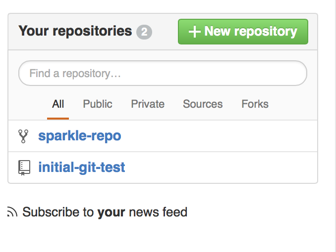
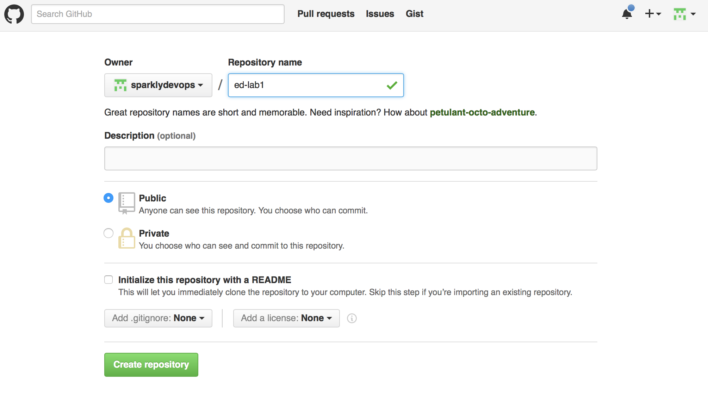
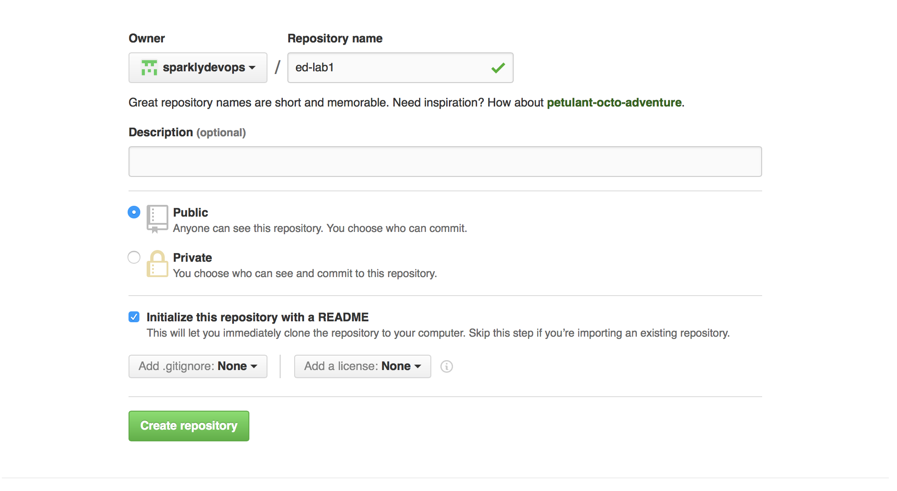
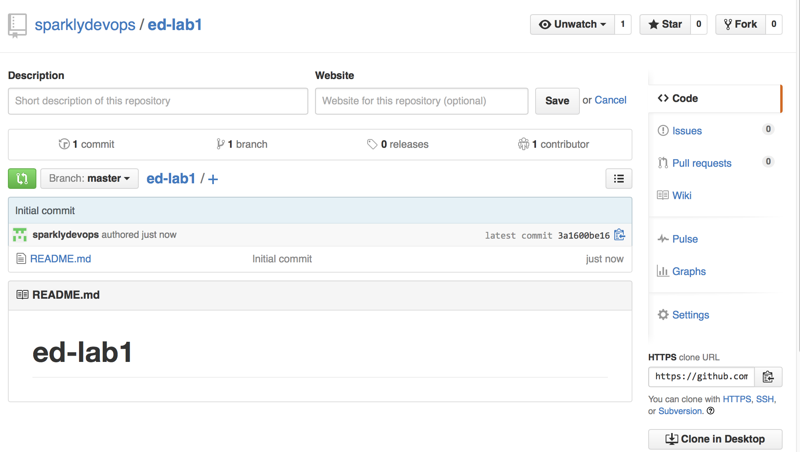
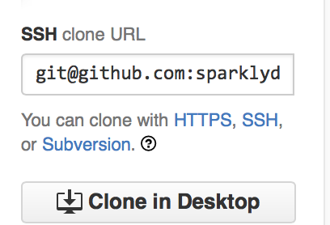

# Verify Local Environment

## Overview

In this exercise each participant configures and tests a local development environment.

## Connect to Node (Everyone)

* ssh chef@NODE 

If you don't have ssh available please downlowd an ssh client. For Windows, a good option is [putty](http://www.putty.org/).


## Introduction to Git

## Customize your workstation (Everyone)

```
   git config --global user.name "YOUR NAME"
   git config --global user.email "YOUR EMAIL ADDRESS"

```

Example: 

```
$ git config --global user.name "Jennifer Davis"
$ git config --global user.email "sparklydevops@gmail.com"
```

## Verify .gitconfig creation (Everyone)

```
   cat ~/.gitconfig
```

Example:

```
   cat ~/.gitconfig
[user]
   name = Jennifer Davis
   email = sparklydevops@gmail.com
```

## Set your preferred git editor (Everyone)

If you don't set your preferred editor, it will use the default text editor for the system.

* emacs
* nano
* vi/vim

```
   git config --global core.editor EDITORNAME
```

Example:
```
$ git config --global core.editor nano
```

## Verify the configuration (Everyone)

```
   git config --list
```

Example Output:

```
[chef@ip-172-31-11-246 hello_world]$ git config --list
user.name=Jennifer Davis
user.email=sparklydevops@gmail.com
core.editor=nano
core.repositoryformatversion=0
core.filemode=true
core.bare=false
```

## Create a project Directory (Everyone)

```
   mkdir wd
   cd wd
```

## Create initial project (Everyone)

```
   mkdir hello_world
   cd hello_world
   git init 
   git status
```

Expected Output
```
[chef@ip-172-31-11-246 hello_world]$ git status
On branch master

Initial commit

nothing to commit (create/copy files and use "git add" to track)
```

Create hello.txt file:

```
   echo "hello world" >> hello.txt
   git status
   git add hello.txt
   git status
   git commit -m "creation of hello.txt file"
   git status

```

Example of first status output:

```
 git status
On branch master

Initial commit

Untracked files:
  (use "git add <file>..." to include in what will be committed)

   hello.txt

nothing added to commit but untracked files present (use "git add" to track)
```

Example of second status output:

```
[chef@ip-172-31-11-246 hello_world]$ git status
On branch master

Initial commit

Changes to be committed:
  (use "git rm --cached <file>..." to unstage)

   new file:   hello.txt
```

Example of third status output:

```
[chef@ip-172-31-11-246 hello_world]$ git status
On branch master
nothing to commit, working directory clean
```

## Create a GitHub identity (Everyone)

* If you don't already have a github account, create one.
* Browse to http://github.com. Supply a username, email address, and password.
* Free plan is fine. Other plans allow you to have private repositories.

## (Optional) Setting up your Github keys (Everyone)

If you want to skip the added burden of entering your username and password each time at the prompt with git, you can follow the steps here to set up your ssh keys:

https://help.github.com/articles/generating-ssh-keys/


## Share your GitHub identity with your group. 

## Create a new remote repo







On the node:

```
   cd ~/wd
   git@github.com:YOURUSERNAME/ed-lab1.git
```

Example:
```
[chef@ip-172-31-11-246 wd]$ git clone git@github.com:sparklydevops/ed-lab1.git
```

## Provide GitHub identities to your instructors. 

* Jennifer Davis, iennae
* Katherine Daniels, kdaniels
 
## Accept invitation to GitHub JoeNGo Organization (Everyone)

Start on this step once your group's Notetaker has provided the GitHub identities for your group to your instructors.

* Visit https://github.com/JoeNGo
* Accept invitation.

## Verify access to repo. (Everyone)

### Create a Working Directory (wd)
* cd ~
* mkdir wd
* cd wd

### Clone the initial-git-test repo 

* git clone https://github.com/JoeNGo/initial-git-test.git
* cd initial-git-test
* git remote -v
* update README.md with your name and email address.
* git status

### Verify that you see that you have modifed README.md 

```
# On branch master
# Changed but not updated:
#   (use "git add <file>..." to update what will be committed)
#   (use "git checkout -- <file>..." to discard changes in working directory)
#
#  modified:   README.md
#
no changes added to commit (use "git add" and/or "git commit -a")

```

* git add README.md
* git commit -m "added name"
* git status

### Verify that your local repo is ready to be pushed to the remote repo.

```
$ git status
# On branch master
# Your branch is ahead of 'origin/master' by 1 commit.
#
nothing to commit (working directory clean)
```

* git push origin master

```
$ git push origin master
Username for 'https://github.com': sparklydevops
Password for 'https://sparklydevops@github.com':
Counting objects: 5, done.
Compressing objects: 100% (2/2), done.
Writing objects: 100% (3/3), 317 bytes, done.
Total 3 (delta 0), reused 0 (delta 0)
To https://github.com/JoeNGo/initial-git-test.git
   9ebac23..b0fe04e  master -> master

```

If you run into conflict, pull updates, handle the conflicts, and resubmit edits.

* git pull origin master

Why could you have run into a conflict?

### Problems

* Are you getting an "Error: Permission to ORG/REPO denied to user" error?
 * Verify that you have been added to the organization to be able to write to repositories.

## Fork team repo (Everyone)

Fork your team's repo into your account, and clone it back to your workstation.
Replace "TEAM" with your TEAM's name. 

* From the GitHub GUI interface, click on your TEAM-repo 
* From the GitHub GUI interface, click on "Fork" and fork into your personal account.
* cd ~/wd
* git clone https://github.com/USER/TEAM-repo.git
* cd TEAM-repo
* git remote -v
* update README.md with your name and email address.
* git add README.md
* git commit -m "added name"
* git push origin master
* From the GitHub GUI interface, click on the pull request icon.
* Add an appropriate message and "Create pull request"
* Merge the pull request in to your project.

## Discuss and decide on a branching strategy. (Team discussion)

What is the process that you will handle collaboration and branching for your repo?

### Update docs (Notetaker)

* add notes taken during the team discussion to skills.md within the repo.
* update docs/branch.md with the team decided strategy
* update docs/nodes.md with the team's node IP addresses

## Outcome 

You should have an updated TEAM-repo with

* updated README with everyone from your team's name and email address
* forked remote TEAM-repo
* updated docs/branch.md, skills.md

