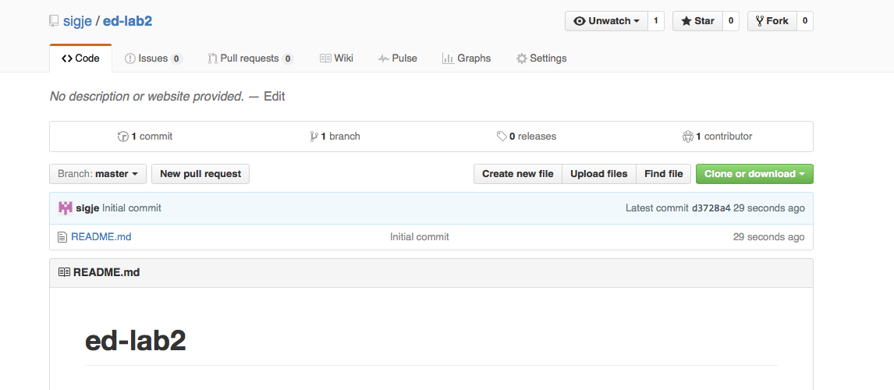

# Adding Collaboration

## Have one person in your team create a repo called ed-lab2.

* Follow the process from Lab 1, and create a repo called ed-lab2. Only one person from the group should do this.
* Share your github identity with the team
* Click on the gear to access the Settings tab

* Click on Collaborators

* Add Collaborators based on github name

* If you have successfully added, they will show up as a Collaborator. 

