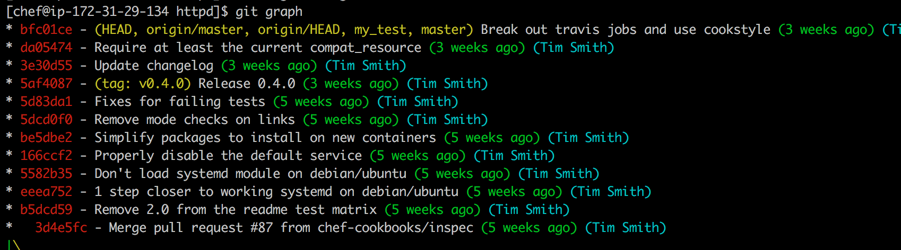

## Update Chef DK

```
curl https://omnitruck.chef.io/install.sh | sudo bash -s -- -c current -P chefdk
```

# Examine .gitconfig

## Git Aliases

You can create aliases for frequently used commands. I use the alias git graph in order to get a nice git log output in combination with using git color features.

```
git config --global alias.graph log --graph --pretty=format:'%Cred%h%Creset -%C(yellow)%d%Creset %s %Cgreen(%cr)%Creset %C(cyan)(%an)%Creset' --abbrev-commit --date=relative
```

The --graph option creates a text based graphical representation of the commit history.

With the --pretty flag, you can specify a formating string.

The format string allows us to focus on what we want to see when looking at the history of commits. In this alias, the symbols translate to showing us the following information in the specific colors.

```
%h: abbreviated commit hash
%d: ref names
%s: subject
%cr: committer date, relative
%an: author name

```

Finally --date=relative shows dates relative to the current time, e.g. “2 hours ago”.

Git color allows you to configure your terminal to improve the terminal output of git commands.

My view when using git graph:




```
[alias]
  graph = log --graph --pretty=format:'%Cred%h%Creset -%C(yellow)%d%Creset %s %Cgreen(%cr)%Creset %C(cyan)(%an)%Creset' --abbrev-commit --date=relative
[color]
  ui = true
[color "branch"]
    current = yellow reverse
    local = yellow
    remote = green

[color "diff"]
    meta = yellow bold
    frag = magenta bold
    old = red bold
    new = green bold

[color "status"]
    added = yellow
    changed = green
    untracked = red
```

Examining dotfiles repos is very instructive in learning new options to improve your experience.

* Fletcher Nichols - https://github.com/fnichol/dotfiles

# Setup a Chef Repository

Before starting any work in this lab, make sure that you read through the entire requirements as a team. Define which items are tasks, which are dependent tasks, and what tasks could potentially cause conflicts in your repository. 

You can track this on your kanban board. 

## Have one person in your team create a repo called ed-lab3.

* Elect one person from your group to create a repo called `ed-lab3`. Follow the process from Lab 1 with one exception, don't create a readme.

## Grant privileges to the ed-lab3 repo to your team.

Follow the process from Lab 2 to grant access to your full team.

## Generate the chef repo.

In this exercise we are creating a monolithic chef-repo. The monolithic chef-repo will hold the global policy items as well as any cookbooks created in this workshop. Generally, when using with a Chef server you choose between one of two strategies. 

You can learn more about these supported workflows at this Chef RFC: https://github.com/chef/chef-rfc/blob/master/rfc019-chef-workflows.md

1. Monolithic Workflow - 1 chef-repo containing everything that maps to 1 repo in source control.
2. 1 cookbook per repo + policy only chef-repo. 


```
 cd ~/wd
 chef generate repo ed-lab3
 cd ~/wd/ed-lab3
 git init .
 git add .
 git commit -m "Initial creation of chef repo"

```

Save the changes and commit back to the ed-lab3 repo created.

```
 git remote add origin git@github.com:USERNAME/ed-lab3.git
 git push -u origin master
```

Example Output

```
[chef@ip-172-31-11-246 ed-lab3]$ git add .
[chef@ip-172-31-11-246 ed-lab3]$ git commit -m "initial creation of chef repo"
[master (root-commit) a590574] Initial creation of chef repo
 16 files changed, 351 insertions(+)
 create mode 100644 .chef-repo.txt
 create mode 100644 .gitignore
 create mode 100644 LICENSE
 create mode 100644 README.md
 create mode 100644 chefignore
 create mode 100644 cookbooks/README.md
 create mode 100644 cookbooks/example/README.md
 create mode 100644 cookbooks/example/attributes/default.rb
 create mode 100644 cookbooks/example/metadata.rb
 create mode 100644 cookbooks/example/recipes/default.rb
 create mode 100644 data_bags/README.md
 create mode 100644 data_bags/example/example_item.json
 create mode 100644 environments/README.md
 create mode 100644 environments/example.json
 create mode 100644 roles/README.md
 create mode 100644 roles/example.json
[chef@ip-172-31-11-246 ed-lab3]$ git remote add origin git@github.com:sparklydevops/ed-lab3.git
[chef@ip-172-31-11-246 ed-lab3]$ git push -u origin master
Counting objects: 24, done.
Compressing objects: 100% (20/20), done.
Writing objects: 100% (24/24), 5.71 KiB | 0 bytes/s, done.
Total 24 (delta 2), reused 0 (delta 0)
To git@github.com:sparklydevops/ed-lab3.git
 * [new branch]      master -> master
Branch master set up to track remote branch master from origin.

```

## Clone the ed-lab3 repo to your node

If you didn't have the task to generate the `ed-lab3` chef-repo, clone your teams repo to your node. 

Replace _USERNAME_ with the github identify of the person who created the repo.


```
   cd ~/wd
   git clone git@github.com:USERNAME/ed-lab3.git
   cd ~/wd/ed-lab3
```


## Split your team up into pairs, max of 3 people per "pair"

* Driver - person working with keyboard
* Observer - person looking at the code 

Work with your team to plan your updates into the repo so that you can do the `git pull`, `git push` to sync your local repo to the to the remote repo as needed.

## Create application cookbook - Pair 1

The _driver_ will type out the commands. The _observer_ will verify for mistakes.

```
 cd ~/wd/ed-lab3/cookbooks
 chef generate cookbook app
 git add app
 git commit -m "creation of app cookbook"
 git push origin master
 cd ~/wd/ed-lab3/cookbooks/app
```

## Install Apache via a Recipe - Pair 1

The _driver_ and _observer_ should switch roles. The _driver_ will type out the commands. The _observer_ will verify for mistakes.


Generate the `install_apache` recipe in the `app` cookbook.

```
cd ~/wd/ed-lab3/cookbooks/app
chef generate recipe . install_apache
nano recipes/install_apache.rb
```

Add the follow `resources` to the `install_apache` recipe.

```
package 'httpd'

service 'httpd' do
  action [ :enable, :start ]
end

```


Edit the default recipe:

```
   nano recipes/default.rb
```

Update the contents of the `default.rb` recipe with the following contents:


```
include_recipe 'app::install_apache'

```

Update the `.kitchen.yml`. 

```

 nano .kitchen.yml
```

Update the `.kitchen.yml` configuration. 

* Change the driver name to _docker_.
* Delete the ubuntu platform
* Modify centos to centos-6.5. Avoid complexity of systemd and RHEL 
* Add the forwarded ports section. 

Update the contents of your .kitchen.yml to match:


```
driver:
  name: docker

## The forwarded_port port feature lets you connect to ports on the VM guest via
## localhost on the host.
## see also: https://docs.vagrantup.com/v2/networking/forwarded_ports.html

network:
    - ["forwarded_port", {guest: 80, host: 80}]

provisioner:
  name: chef_zero

## require_chef_omnibus specifies a specific chef version to install. You can
## also set this to `true` to always use the latest version.
## see also: https://docs.chef.io/config_yml_kitchen.html

#  require_chef_omnibus: 12.5.0

platforms:
  - name: centos-6.5
    driver_config:
      forward:
      - 80:80
      
suites:
  - name: default
    attributes:

```

```
platforms:
  - name: centos-6.5
    driver_config:
      forward:
      - 80:80
```
 

`kitchen login ` and verify on the docker image directly. 


```
chef install
kitchen converge 

```

How do you know if your recipe worked? Kitchen converge finishes without errors, and you have a port up and running. You can check by browsing directly to the node because you have set up port forwarding!

Validate your node has apache up and running:

```
curl localhost

```

Once you have verified that you have Apache up and running, commit your changes to your local and remote repositories.

```
cd ~/wd/ed-lab3/cookbooks
git add app
git commit -m "install and configure apache"
git push origin master
```
 
## Include mysql cookbook from supermarket - Pair 2

This step depends on the app cookbook being created by Pair 1. Make sure that you have pulled from the remote repository.

```
   cd ~/wd/ed-lab3
   git pull origin master 
   cd ~/wd/ed-lab3/cookbooks/app
```

If you get an error with the _app_ directory not existing, coordinate with the first Pair on your team.

[Supermarket](https://supermarket.chef.io) is the Chef community site. Before using community cookbooks in your environment, always inspect the cookbook. You run the code with root privileges!


Edit the default recipe:

```
   nano ~/wd/ed-lab3/cookbooks/app/recipes/default.rb
```

Update the contents of the `default.rb` recipe with the following contents:

```
include_recipe 'app::mysql_service'

```


We will use the mysql cookbook. The [mysql cookbook](https://github.com/chef-cookbooks/mysql) is a library cookbook, and contains no recipes. It only has resources that we can use that extend the available resources to manage. We will use the mysql_service resource. You can also read the examples in the [mysql cookbook README](https://github.com/chef-cookbooks/mysql) to understand how to use the other available mysql resources.


Generate the `mysql_service` recipe in the `app` cookbook.

```
   chef generate recipe . mysql_service
   nano recipes/mysql_service.rb
```

 
Add the follow `resource` to the `mysql_service` recipe.

```
mysql_service 'joengo' do
  port '3306'
  version '5.5'
  initial_root_password 'banana'
  action [:create, :start]
end
```

Edit the _metadata.rb_ file to add a dependency on the mysql community cookbook. In your production environment, you would validate the contents of mysql prior to using it in a deployment scenario.:

```
nano metadata.rb
```

Update the contents of the `metadata.rb` file.:

```
depends 'mysql', '~> 6.0'
```


Update the `.kitchen.yml`. 

```
 nano .kitchen.yml
```

Update the `.kitchen.yml` configuration. 

* Change the driver name to _docker_.
* Delete the ubuntu platform
* Modify centos to centos-6.5. Avoid complexity of systemd and RHEL 7.
* Uncomment out the forwarded port section.

Update the contents of your .kitchen.yml to match:


```
driver:
  name: docker

## The forwarded_port port feature lets you connect to ports on the VM guest via
## localhost on the host.
## see also: https://docs.vagrantup.com/v2/networking/forwarded_ports.html

network:
    - ["forwarded_port", {guest: 80, host: 80}]

provisioner:
  name: policyfile_zero

## require_chef_omnibus specifies a specific chef version to install. You can
## also set this to `true` to always use the latest version.
## see also: https://docs.chef.io/config_yml_kitchen.html

#  require_chef_omnibus: 12.5.0

platforms:
  - name: centos-6.5
    driver_config:
      forward:
      - 80:80
suites:
  - name: default
    attributes:

```

Solve dependency constraints, install 3rd party cookbooks. `chef install` will have a `Policyfile.lock.json` as output. `kitchen converge` will set up docker container, install chef (if needed), and converge based on the runlist as descirbed in `Policyfile.rb`.

```
chef install
kitchen converge 

```

How do you know if your recipe worked? Kitchen converge finishes without errors, and mysql is up and running. You can check by browsing directly to the node because you have set up port forwarding!


```
cd ~/wd/ed-lab3/cookbooks
git add app
git commit -m "install and configure mysql"
git push origin master
```

## Verify your development environment is consistent 

Update your development enviornment.


```
 cd ~/wd/ed-lab3
 git pull origin master
```


## Outcome 

You should have an updated _ed-lab3_ with

* chef repo with mysql and apache recipes.


Hints in the [Lab 3 background](lab_background_3.md)
