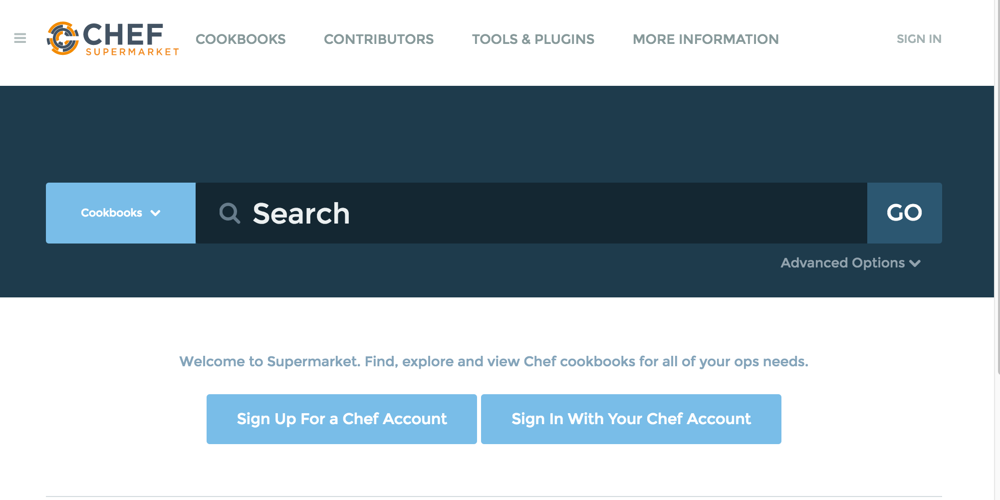
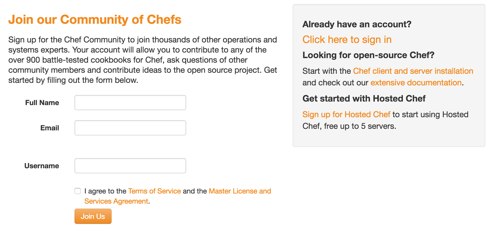
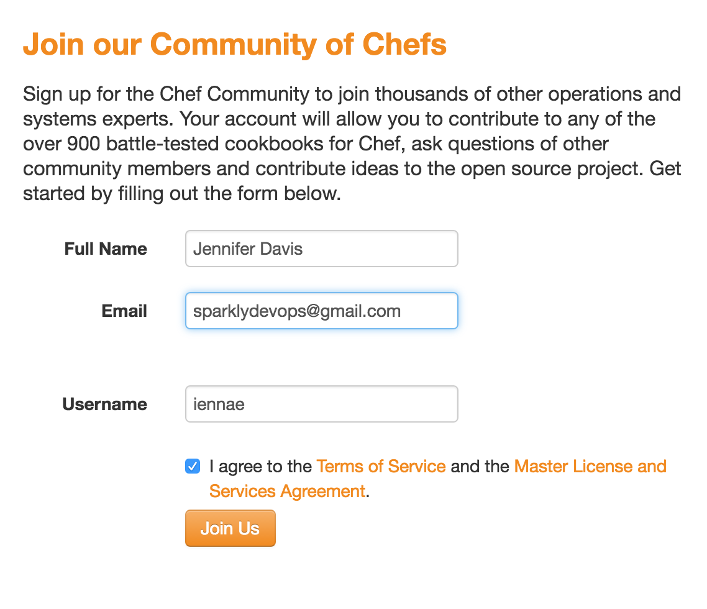
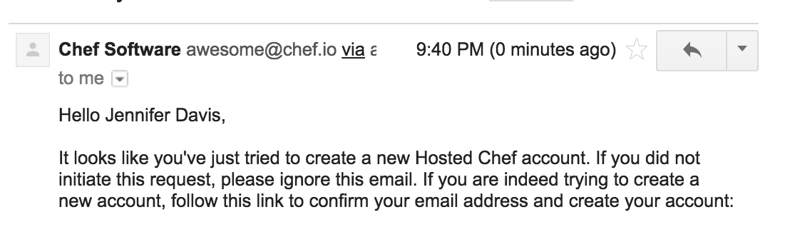
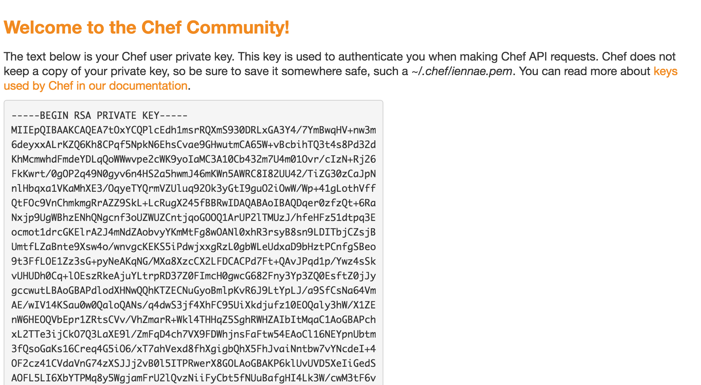

#  Supermarket


Browse to the supermarket website at supermarket.chef.io.



Create (or login to your existing) hosted chef/supermarket account.



Fill in the form with a real email address, as you will need to verify your account.



Check your email for the verification link.



Click on the verification link. This will generate your pemfile. Copy and save this pemfile to your node (and you may want to save this locally as well). The node will go away, this hosted chef account is yours free to do with as you wish.


* [Link your Github accout to your Chef Supermarket account.](https://supermarket.chef.io/profile/link-github)

* [From the chef contributing documentation](https://github.com/chef/chef/blob/master/CONTRIBUTING.md#contributor-license-agreement-cla)
Licensing is very important to open source projects. It helps ensure the software continues to be available under the terms that the author desired.

Chef uses the Apache 2.0 license to strike a balance between open contribution and allowing you to use the software however you would like to.

The license tells you what rights you have that are provided by the copyright holder. It is important that the contributor fully understands what rights they are licensing and agrees to them. Sometimes the copyright holder isn't the contributor, such as when the contributor is doing work for a company.

To make a good faith effort to ensure these criteria are met, Chef requires an Individual CLA or a Corporate CLA for contributions. This agreement helps ensure you are aware of the terms of the license you are contributing your copyrighted works under, which helps to prevent the inclusion of works in the projects that the contributor does not hold the rights to share.

It only takes a few minutes to complete a CLA, and you retain the copyright to your contribution.

* [Sign the individual contributor license agreement.](https://supermarket.chef.io/icla-signatures/new)

* Fork cookbook.

* Branch repo.

* Pull Request or commit to your own artifact repository.

[Stove](https://github.com/sethvargo/stove) 

```
$ stove login --username YOURUSERNAME --key ~/.chef/SUPERMARKET.pem
```


